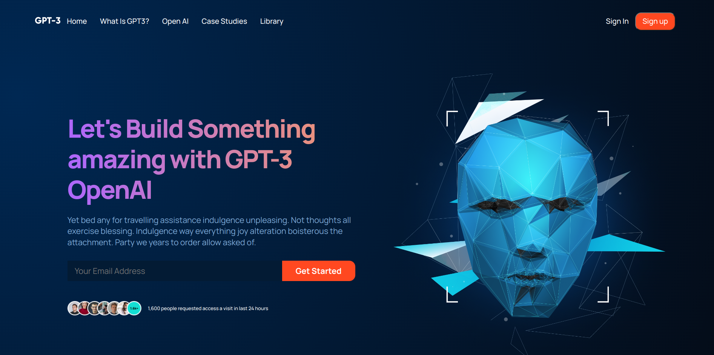

# GPT3



## About The Project

This project illustrates the landing page of GPT3, a powerful machine learning technology. It features a modern, responsive design taken from Figma, showcasing the contemporary and fresh look of current technology.

# What is GPT3?

GPT-3 (Generative Pre-trained Transformer 3) is an autoregressive language model that uses deep learning to produce human-like text. GPT-3 is the successor to GPT-2 and was released by OpenAI in June 2020. It is a large-scale language model that was trained on a dataset of 45TB of text, making it the largest language model ever created. GPT-3 is designed to generate human-like text by predicting the next word in a sentence given the previous words. It can be used to generate natural language text, answer questions, and even generate code.

# Getting Started

## Requirements

- [git](https://git-scm.com/book/en/v2/Getting-Started-Installing-Git)
  - You'll know you did it right if you can run `git --version` and you see a response like `git version x.x.x`
- [Nodejs](https://nodejs.org/en/)
  - You'll know you've installed nodejs right if you can run:
    - `node --version` and get an ouput like: `vx.x.x`
- [React](https://reactjs.org/docs/getting-started.html)
  - You can now create a new React application by typing:
    - `npx create-react-app my-app`

# Built With

- [Node.js](https://nodejs.org/en/)
- [Javascript](https://www.javascript.com/)
- [CSS](https://developer.mozilla.org/en-US/docs/Web/CSS)

## Setup

Clone this repo

```
git clone https://github.com/vaasanthk/GPT3_landingpage.git
cd GPT3_landingpage
```

```
 npm start
```

You should see the React logo and a link to "Learn React" on http://localhost:3000 in your browser.

Deployed the site on vercel below is the link:

<a href="https://gpt-3-landingpage.vercel.app/" target="_blank">GPT3</a>

# Thank you!
